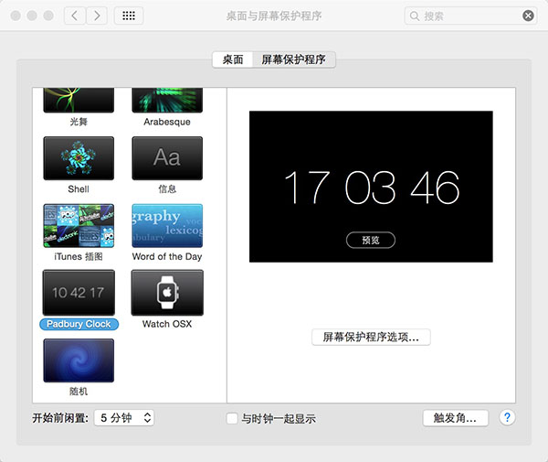

title: Mac设置简约好看的屏保
date: 2016-02-26
tags: mac
categories: 工具
keywords: mac,屏幕保护
---
   在电脑黑屏时，显得有逼格一点也是极好的，下面让我们花3分钟设置一个简约好看的mac屏保

## 1.下载.saver程序包
[简约数字时钟和apple watch时间显示-下载](http://share.weiyun.com/0bc0672ffb44112ff957ee3aed3453d1)
解压安装就OK
<!--more-->
## 2.设置屏保
系统偏好设置-->桌面与保护程序-->选择新安装的包

## 3.最终效果
Padbury Clock:

Watch OS的大家可以自己设置查看效果
